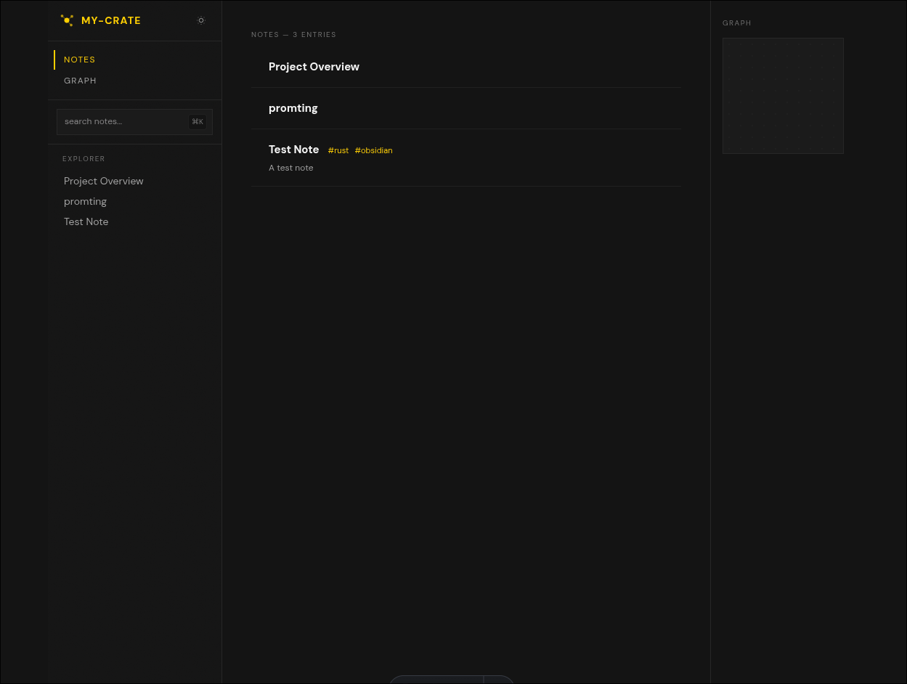

# MY-CRATE

> Self-hosted publishing for your Obsidian vault. No subscriptions, no lock-in, full control.

Obsidian Publish is a fast, self-hosted platform that transforms your Obsidian vault into a beautiful, browsable website. It indexes your markdown files, serves them via a REST API, and provides a modern web frontend with search, backlinks, and interactive graph visualization.



---

## Features

- **Instant Search** - Full-text search with FlexSearch, no backend query needed
- **Backlinks** - Automatically discover linked references between notes
- **Interactive Graph** - D3-powered force-directed graph of your note relationships
- **LaTeX Support** - Renders math expressions with KaTeX
- **Table of Contents** - Auto-generated ToC from headings, sticky sidebar navigation
- **Tag System** - Browse notes by tags with dedicated tag pages
- **Git Webhook** - Auto-reindex on push with HMAC verification
- **Mobile-First** - Responsive design with hamburger navigation

---

## Quick Start

Get a local instance running in under 5 minutes.

### Prerequisites

| Tool | Version | Purpose |
|------|---------|---------|
| [Rust](https://rustup.rs/) | 1.70+ | Indexer & webhook |
| [Bun](https://bun.sh/) | 1.0+ | API server |
| [Node.js](https://nodejs.org/) | 20+ | Frontend build |

### 1. Clone and Setup

```bash
git clone <repository>
cd obsidian-publish

# Create data directory
mkdir -p data
```

### 2. Index Your Vault

```bash
cd indexer
cargo run --release -- \
  --vault ../vault \
  --db ../data/notes.db
```

The indexer parses all `.md` files, extracts frontmatter, wikilinks, and generates HTML.

### 3. Start All Services

From the project root:

```bash
./start.sh
```

This starts three services:

| Service | Port | Description |
|---------|------|-------------|
| API | 3001 | Hono.js REST API |
| Web | 4321 | Astro dev server |
| Webhook | 3002 | Git push listener |

Visit `http://localhost:4321` to see your published vault.

---

## Architecture

```
┌─────────────┐     ┌─────────────┐     ┌─────────────┐
│   Vault/    │────▶│  Indexer    │────▶│  SQLite DB  │
│   .md files │     │    (Rust)   │     │             │
└─────────────┘     └─────────────┘     └──────┬──────┘
                                               │
                        ┌──────────────────────┘
                        ▼
┌─────────────┐     ┌─────────────┐     ┌─────────────┐
│   Webhook   │────▶│  Hono API   │◀────│   Astro     │
│   (Rust)    │     │   (Bun)     │     │  Frontend   │
└─────────────┘     └─────────────┘     └─────────────┘
       ▲                                            │
       └────────────────────────────────────────────┘
                    Git push triggers reindex
```

### Components

#### Indexer (`/indexer`)

Rust binary that walks your vault and populates the database.

```bash
cargo run --release -- --vault /path/to/vault --db /path/to/db.sqlite
```

**What it indexes:**

- Frontmatter (title, description, tags)
- Markdown → HTML (via `pulldown-cmark`)
- Wikilinks `[[Note Title]]` and embeds `![[Image]]`
- Table of contents from headings
- LaTeX detection (`$...$` and `$$...$$`)

#### API (`/api`)

Hono.js server providing REST endpoints.

```typescript
// Start standalone
cd api && bun run index.ts
```

#### Web (`/web`)

Astro frontend with React islands.

```bash
cd web && npm run dev     # Development
npm run build             # Production build
```

#### Webhook (`/webhook`)

Rust service that listens for git pushes and triggers reindexing.

```bash
cd webhook
WEBHOOK_SECRET=your-secret \
VAULT_PATH=./vault \
DB_PATH=./data/notes.db \
INDEXER_PATH=./indexer/target/release/indexer \
cargo run
```

### Connecting GitHub webhook

1. Go to your vault repo - **Settings - Webhooks - Add webhook**
2. **Payload URL:** `https://your-domain.com/webhook`
3. **Content type:** `application/json`
4. **Secret:** same value as `WEBHOOK_SECRET` in your `.env`
5. **Event:** push only

Every push to your vault repo now triggers `git pull` + re-index on the server automatically.

---

## API Reference

Base URL: `http://localhost:3001`

### List Notes

```http
GET /api/notes
```

```json
[
  {
    "slug": "getting-started",
    "title": "Getting Started",
    "description": "Overview of the platform",
    "tags": ["guide"],
    "has_latex": false
  }
]
```

### Get Note

```http
GET /api/notes/:slug
```

```json
{
  "slug": "getting-started",
  "title": "Getting Started",
  "html": "<p>Welcome...</p>",
  "toc": [
    { "level": "H1", "text": "Getting Started", "anchor": "getting-started" },
    { "level": "H2", "text": "Installation", "anchor": "installation" }
  ],
  "tags": ["guide"],
  "description": "Overview",
  "frontmatter": { "title": "Getting Started" }
}
```

### Get Backlinks

```http
GET /api/notes/:slug/backlinks
```

```json
[
  { "slug": "related-topic", "title": "Related Topic" }
]
```

### Search Index

```http
GET /api/search
```

Returns all notes with `raw_md` field for client-side FlexSearch indexing.

### Graph Data

```http
GET /api/graph
```

```json
{
  "nodes": [{ "slug": "note-1", "title": "Note 1" }],
  "edges": [
    { "source_slug": "note-1", "target_slug": "note-2", "is_embed": 0 }
  ]
}
```

### Tags

```http
GET /api/tags
GET /api/tags/:tag
```

---

## Configuration

### Environment Variables

#### API

| Variable | Default | Description |
|----------|---------|-------------|
| `PORT` | `3001` | Server port |
| `DATABASE_URL` | `./data/notes.db` | SQLite database path |

#### Webhook

| Variable | Required | Description |
|----------|----------|-------------|
| `WEBHOOK_SECRET` | Yes | HMAC secret for verification |
| `VAULT_PATH` | Yes | Path to git repository |
| `DB_PATH` | Yes | Path to SQLite database |
| `INDEXER_PATH` | Yes | Path to indexer binary |
| `PORT` | `3002` | Webhook server port |

#### Web

| Variable | Default | Description |
|----------|---------|-------------|
| `API_URL` | `http://localhost:3001` | API base URL |

---

## Development

### Running Individual Services

```bash
# Terminal 1: API
cd api && bun run index.ts

# Terminal 2: Frontend
cd web && npm run dev

# Terminal 3: Webhook (optional)
cd webhook && WEBHOOK_SECRET=dev VAULT_PATH=./vault DB_PATH=./data/notes.db INDEXER_PATH=../indexer/target/debug/indexer cargo run
```

### Database Schema

The indexer creates these tables:

```sql
notes       -- slug, title, html, raw_md, frontmatter, toc, etc.
links       -- source_slug, target_slug, is_embed
tags        -- tag name
tag_notes   -- tag ↔ note mapping
```

### Adding a New Page

Create `.astro` files in `web/src/pages/`:

```astro
---
import BaseLayout from "../layouts/BaseLayout.astro";

const API = "http://localhost:3001";
const res = await fetch(`${API}/api/notes`);
const notes = await res.json();
---

<BaseLayout title="My Page" notes={notes}>
  <h1>Hello World</h1>
</BaseLayout>
```

### Re-indexing manually

If you add notes directly to the server:

```bash
./indexer/target/release/indexer --vault ./vault --db ./data/notes.db
```

---

## Deployment

### One-command setup

```bash
git clone https://github.com/Rohit-48/my-crate-
cd my-crate-
cp env.example .env
nano .env          # fill in WEBHOOK_SECRET and SERVICE_USER
chmod +x setup.sh
./setup.sh
```

`setup.sh` handles everything: builds all binaries, installs dependencies, builds the frontend, runs the indexer, configures Nginx, and sets up systemd services. Your site is live at `http://your-server-ip` when it completes.

### Prerequisites (Ubuntu 22.04 / 24.04)

```bash
sudo apt update && sudo apt upgrade -y
sudo apt install -y git curl build-essential pkg-config libssl-dev libsqlite3-dev nginx

# Node.js 22
curl -fsSL https://deb.nodesource.com/setup_22.x | sudo -E bash -
sudo apt install -y nodejs

# Bun
curl -fsSL https://bun.sh/install | bash && source ~/.bashrc

# Rust
curl --proto '=https' --tlsv1.2 -sSf https://sh.rustup.rs | sh -s -- -y
source ~/.cargo/env
```

### Environment variables

Copy `env.example` to `.env` and configure:

| Variable | Required | Default | Description |
|----------|----------|---------|-------------|
| `WEBHOOK_SECRET` | Yes | - | HMAC secret for GitHub webhook verification. Generate with `openssl rand -hex 32` |
| `SERVICE_USER` | Yes | - | Unix user that runs the systemd services (e.g. `ubuntu`, `void`) |
| `API_PORT` | No | `3001` | Hono API port |
| `WEB_PORT` | No | `4321` | Astro frontend port |
| `WEBHOOK_PORT` | No | `3002` | Webhook listener port |

> **Warning:** Never commit `.env` to git. It's in `.gitignore` by default.

### Systemd services

After running `setup.sh`, three systemd services manage your stack:

| Service | Port | Description |
|---------|------|-------------|
| `my-crate-api` | 3001 | Hono.js API, reads SQLite |
| `my-crate-webhook` | 3002 | Rust webhook listener |
| `my-crate-web` | 4321 | Astro SSR frontend |

```bash
# Check status
sudo systemctl status my-crate-api my-crate-webhook my-crate-web

# View logs
sudo journalctl -u my-crate-api -f

# Restart a service
sudo systemctl restart my-crate-api
```

Services auto-start on reboot and auto-restart on crash.

### Domain + SSL

Point your domain's A record at your server IP, then:

```bash
sudo apt install certbot python3-certbot-nginx
sudo certbot --nginx -d your-domain.com
```

Certbot edits your Nginx config automatically and sets up auto-renewal.

### Firewall

```bash
sudo ufw allow 22
sudo ufw allow 80
sudo ufw allow 443
sudo ufw enable
```

This blocks direct access to internal ports (3001, 3002, 4321) while keeping the site accessible.

---

## NixOS Support

This project includes a Nix flake for reproducible development.

```bash
nix develop  # Enter dev shell
```

See [NIXOS_SETUP.md](NIXOS_SETUP.md) for detailed instructions.

---

## Project Structure

```
obsidian-publish/
├── api/              # Hono.js REST API (Bun)
│   ├── index.ts
│   └── routes/
├── web/              # Astro frontend
│   ├── src/
│   │   ├── components/   # React islands
│   │   ├── layouts/
│   │   ├── pages/
│   │   └── styles/
│   └── package.json
├── indexer/          # Rust markdown indexer
│   └── src/
│       ├── main.rs
│       ├── db.rs
│       └── parser.rs
├── webhook/          # Rust git webhook
│   └── src/
│       └── main.rs
├── data/             # SQLite database
├── vault/            # Your Obsidian vault (git repo)
└── start.sh          # Start all services
```

---

## Contributing

1. Fork the repository
2. Create a feature branch: `git checkout -b feature/my-feature`
3. Make your changes
4. Run tests: `cargo test` (Rust), `npm test` (Web)
5. Submit a pull request

---

## License

MIT License - see [LICENSE](LICENSE) for details.

---
